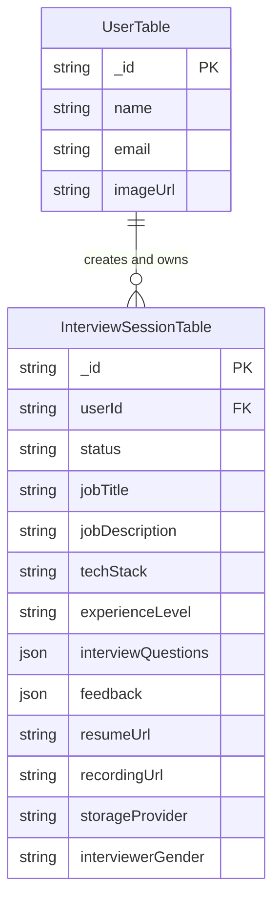

# 2. COMPLETE TECHNOLOGY STACK

### 1. Technology Master Table

| Technology | Version | Why Used | Where Used | Alternative |
| :--- | :--- | :--- | :--- | :--- |
| **Next.js** | `15.4.10` | Server-Side Rendering (SSR), Client Components, App Router routing, and integrated API routes. | Core framework across `app/` pages, layouts, and `app/api/*` endpoint handlers. | React SPA (Vite), Remix, Express + React |
| **React** | `19.1.0` | Declarative UI rendering, hooks state management, and component architecture. | Client components in `app/(routes)/*`, `components/ui/*`. | Vue.js, Svelte, Angular |
| **TypeScript** | `^5` | Static type safety, strict interface declarations, compile-time bug prevention. | Entire codebase across `.ts` and `.tsx` files. | Plain JavaScript |
| **Convex DB** | `^1.25.4` | Serverless reactive document database, real-time live updates, cloud file storage. | `convex/schema.ts`, `convex/Interview.ts`, `convex/users.ts`. | Firebase Firestore, Supabase PostgreSQL, MongoDB Atlas |
| **Clerk** | `^6.39.7` | Zero-boilerplate user authentication, OAuth providers, session tokens, secure route middleware. | `middleware.ts`, `app/Provider.tsx`, `app/(auth)/*`. | NextAuth.js (Auth.js), Firebase Auth, Supabase Auth |
| **Google Gemini API** | `1.5-flash` | Ultra-fast LLM text generation for real-time adaptive follow-ups and prompt evaluation. | `lib/roleInterviewerEngine.ts`, `app/api/generate-followup-question/route.tsx`. | OpenAI GPT-4o-mini, Anthropic Claude 3.5 Haiku |
| **ImageKit** | `^6.0.0` | Cloud media file storage for PDF resumes and interview recording fallback. | `app/api/generate-interview-questions/route.tsx`, `app/api/upload-recording/route.ts`. | AWS S3, Cloudinary, Firebase Storage |
| **Supabase Storage** | `^2.53.0` | Bucket-based cloud video recording storage (`interview-recordings`). | `app/api/upload-recording/route.ts`, `app/api/delete-recording/route.ts`. | AWS S3, Google Cloud Storage |
| **Arcjet** | `^1.0.0-beta.10` | Rate limiting, bot protection, and token bucket security rules. | `utils/arcjet.ts`, `app/api/generate-interview-questions/route.tsx`, `app/api/arcjet/route.ts`. | Upstash Redis Rate Limit, Cloudflare WAF |
| **Tailwind CSS** | `^4` | Utility-first CSS styling, responsive grid layouts, dark mode variables. | `app/globals.css`, `tailwind.config.ts`, component inline classes. | Vanilla CSS, Bootstrap, Styled Components |
| **Shadcn UI / Radix** | `1.1-1.2` | Accessible unstyled UI primitives (Dialog, Tabs, Slot) customized with Tailwind. | `components/ui/*` (dialog.tsx, tabs.tsx, button.tsx). | Material UI (MUI), Ant Design, Chakra UI |
| **Web Speech API** | Native Browser | Zero-cost browser speech synthesis (TTS) and speech recognition (STT). | `app/(routes)/interview/[interviewId]/start/page.tsx`, `utils/interviewerConfig.ts`. | OpenAI Whisper API, ElevenLabs Voice API |
| **Canvas 2D API** | Native Browser | Real-time HTML5 webcam frame sampling for posture & eye contact telemetry. | `utils/facialAnalysis.ts`, `app/(routes)/interview/[interviewId]/start/page.tsx`. | MediaPipe, TensorFlow.js, OpenCV.js |
| **IndexedDB** | Native Browser | Client-side persistent storage for offline video recording buffers before cloud upload. | `utils/recordingStorage.ts` (`MAPD_Interview_Recordings_DB`). | LocalStorage, SessionStorage |
| **Lucide React** | `^0.536.0` | Modern SVG iconography. | Used across all UI pages and components. | Heroicons, FontAwesome |
| **Sonner** | `^2.0.7` | Custom toast notifications for async API updates. | Used across dashboard, preparation, and live session pages. | React Toastify, Hot Toast |
| **Next-Themes** | `^0.4.6` | Client-side dark mode theme switching without layout flash. | `app/layout.tsx`, `app/_components/ThemeToggle.tsx`. | Manual CSS class toggling |

---

### 2. Technology Breakdown & Interview Answers

#### A. Next.js 15 (App Router)
1. **What is it?** Next.js is a full-stack React framework that provides server-side rendering, static site generation, serverless API routes, and optimized file-system routing via the App Router.
2. **Why was it selected?** It allows seamless integration of server components, API endpoints, and client-side reactive components in a unified TypeScript codebase, eliminating the need for a separate backend server.
3. **Where is it used?** Used for the entire project structure in `app/`, managing page layouts (`layout.tsx`), page routes (`page.tsx`), serverless endpoints (`app/api/*`), and middleware (`middleware.ts`).
4. **What problem does it solve?** Solves CORS issues between frontend and backend, optimizes client bundle size via Server Components, and provides fast initial page loads with SSR.
5. **Alternatives:** Vite + Express.js, Remix, Nuxt.js.
6. **Interview Question:** *"Why use Next.js App Router over traditional React SPA with Client-Side Routing?"*
7. **Interview-Ready Answer:** *"Next.js App Router provides Server Components by default, which reduces the JavaScript payload sent to the browser. It also unifies backend API routes and frontend pages in one project, simplifying deployment and eliminate cross-origin CORS complexity."*

#### B. Convex Database
1. **What is it?** Convex is a serverless reactive document database built for web applications that provides real-time state synchronization, file storage, and serverless TypeScript functions.
2. **Why was it selected?** It eliminates database connection pooling overhead and allows instantaneous UI updates whenever interview records or feedback data change.
3. **Where is it used?** Defined in `convex/schema.ts` (`UserTable`, `InterviewSessionTable`) and executed in `convex/Interview.ts` and `convex/users.ts`.
4. **What problem does it solve?** Replaces traditional ORM database boilerplate (Prisma/TypeORM) and WebSocket setup with reactive TypeScript queries (`useQuery`) and mutations (`useMutation`).
5. **Alternatives:** Firebase Firestore, Supabase PostgreSQL, MongoDB Atlas.
6. **Interview Question:** *"How does Convex handle real-time data sync compared to traditional REST polling?"*
7. **Interview-Ready Answer:** *"Convex uses persistent WebSocket connections to stream query updates to the client. Whenever a mutation patches a record in `InterviewSessionTable`, all subscribed `useQuery` hooks automatically re-render with fresh data without manual HTTP polling."*

#### C. Clerk Authentication
1. **What is it?** Clerk is an end-to-end user management and authentication service for modern web applications.
2. **Why was it selected?** Provides production-ready sign-in/sign-up components, JWT session token management, and simple Next.js middleware protection.
3. **Where is it used?** Configured in `middleware.ts`, wrapped in `app/ConvexClientProvider.tsx` and `app/Provider.tsx`, and used in `app/(auth)/*`.
4. **What problem does it solve?** Eliminates the risk of implementing password hashing, OAuth login flow, or JWT cookie expiration manually.
5. **Alternatives:** NextAuth.js (Auth.js), Supabase Auth, Firebase Auth.
6. **Interview Question:** *"How is user data synchronized between Clerk and your database?"*
7. **Interview-Ready Answer:** *"In `app/Provider.tsx`, a `useEffect` hook triggers whenever Clerk's `useUser` context loads. It calls the Convex mutation `CreateNewUser`, passing the candidate's email, name, and profile image. The mutation checks if the user exists in `UserTable` by email; if not, it inserts a new record and returns the database ID."*

---

# 3. PROJECT ARCHITECTURE

### 1. High-Level System Architecture

The application follows a modern **Serverless Monolith with Event-Driven AI & Multi-Storage Tier** architecture:

```
[ User Browser ]
   │
   ├── (1) HTTP / HTML / JS Bundle ──► [ Next.js 15 App Router on Vercel / Netlify ]
   │
   ├── (2) Auth Session Tokens ─────► [ Clerk Authentication Engine ]
   │
   ├── (3) Live Reactive WebSockets ─► [ Convex Serverless DB & Object Storage ]
   │
   ├── (4) REST API Calls ──────────► [ Next.js API Routes (app/api/*) ]
   │                                     │
   │                                     ├──► [ Google Gemini 1.5 Flash API ]
   │                                     ├──► [ ImageKit Cloud Media API ]
   │                                     ├──► [ Supabase Object Storage ]
   │                                     └──► [ Arcjet Token Bucket Security ]
   │
   └── (5) Browser Subsystems
         ├── Web Speech API (TTS Persona Voice & STT Voice Transcription)
         ├── HTML5 Canvas 2D Context (Real-Time Vision & Posture Telemetry)
         └── IndexedDB (Local Video Recording Buffer Backup)
```

---

### 2. Request-Response Execution Flow

Here is the exact internal trace when a candidate performs the primary action: **Creating and Completing an Interview Session**:

```
Candidate Fills Interview Form
   │
   ▼ (Form Submit with Role & Tech Stack)
[ CreateInterviewDialog.tsx ]
   │
   ▼ (POST multipart/form-data)
[ app/api/generate-interview-questions/route.tsx ]
   │
   ├──► Arcjet Rate Limit Check (aj.protect)
   ├──► ImageKit PDF Resume Upload (if file attached)
   └──► Call roleInterviewerEngine.ts -> generateRoleAwareQuestions()
   │
   ▼ (Returns 8-Phase Questions Array)
[ SaveInterviewQuestion Mutation in convex/Interview.ts ]
   │
   ▼ (Inserts record into InterviewSessionTable with status 'draft')
Redirect Candidate to [ app/(routes)/interview/[interviewId]/page.tsx ]
   │
   ▼ (Device Readiness Check: Cam & Mic)
Candidate Clicks "Start Interview" -> Navigates to [ .../start/page.tsx ]
   │
   ├──► Web Speech API speaks Phase 1 Intro ("Tell me about yourself")
   ├──► Canvas 2D Vision Telemetry loops frame sampling @ 1.2s interval
   ├──► MediaRecorder captures video stream to IndexedDB buffer
   │
   ▼ (Candidate speaks answer & clicks "Next Question")
[ app/api/generate-followup-question/route.tsx ]
   │
   ├──► Calls Gemini 1.5 Flash API (evaluates response & probes tech stack)
   └──► Fallback: Role Intelligence Engine (pivots if candidate struggled)
   │
   ▼ (All 8 Questions Completed -> Click "End Call")
[ uploadRecordingToCloud() in utils/recordingStorage.ts ]
   │
   ├──► Direct Convex Storage Upload / Supabase / ImageKit / Server Disk
   └──► SaveInterviewRecording Mutation in convex/Interview.ts
   │
   ▼ (POST candidate answers to app/api/interview-feedback/route.tsx)
[ evaluateCandidateAnswers() ]
   │
   ├──► Grounded transcript technical scoring & evidence quotes
   ├──► Filler word regex parsing & speaking WPM calculation
   └──► Weighted formula: Tech(35%) + Prob(25%) + Rel(15%) + Comp(15%) + Comm(10%)
   │
   ▼ (UpdateFeedback Mutation in convex/Interview.ts)
Patches record with feedback JSON & sets status to 'complete'
   │
   ▼ (Redirect Candidate)
[ app/(routes)/interview/[interviewId]/feedback/page.tsx ]
```

---

# 4. SYSTEM ARCHITECTURE DIAGRAMS

### 1. High-Level Architecture Diagram

```
+-----------------------------------------------------------------------------------+
|                                 CLIENT BROWSER                                    |
|  +------------------+  +-------------------+  +--------------------------------+  |
|  | Next.js App UI   |  | Web Speech API    |  | Canvas 2D Computer Vision      |  |
|  | (React 19)       |  | (Voice Synthesis) |  | (Centroid & Stress Telemetry) |  |
|  +--------+---------+  +---------+---------+  +---------------+----------------+  |
+-----------|----------------------|----------------------------|-------------------+
            |                      |                            |
            | HTTP / WebSockets    | Voice Output               | Frame Samples
            v                      v                            v
+-----------------------------------------------------------------------------------+
|                                SERVERLESS BACKEND                                 |
|  +-----------------------------------+  +--------------------------------------+  |
|  | Next.js API Routes (app/api/*)    |  | Convex Serverless Functions          |  |
|  | - generate-interview-questions    |  | - SaveInterviewQuestion              |  |
|  | - generate-followup-question      |  | - GetInterviewQuestions              |  |
|  | - interview-feedback              |  | - UpdateFeedback                     |  |
|  | - upload-recording                |  | - SaveInterviewRecording             |  |
|  +-----------------+-----------------+  +------------------+-------------------+  |
+--------------------|---------------------------------------|----------------------+
                     |                                       |
                     v External API Calls                    v DB Reactive Stream
+-----------------------------------------------------------------------------------+
|                             EXTERNAL SERVICES & DATABASE                          |
|  +-------------------+  +--------------------+  +------------------------------+  |
|  | Google Gemini     |  | Convex Document    |  | Storage Providers            |  |
|  | 1.5 Flash API     |  | Database           |  | (Convex / Supabase / IK)     |  |
|  +-------------------+  +--------------------+  +------------------------------+  |
+-----------------------------------------------------------------------------------+
```

---

# 5. COMPLETE FOLDER STRUCTURE

```
ai-mock-interview-2.0/
├── .env.example                       # Environment variables template file
├── .env.local                         # Local environment API keys (Clerk, Convex, Gemini, ImageKit, Arcjet)
├── .gitignore                         # Version control exclusion rules (node_modules, .next, .env)
├── components.json                    # Shadcn UI configuration mapping
├── middleware.ts                      # Clerk authentication middleware route protection
├── netlify.toml                       # Netlify build and plugin deployment configuration
├── next.config.ts                     # Next.js framework configuration options
├── package.json                       # Project dependencies and script declarations
├── postcss.config.mjs                 # PostCSS configuration for Tailwind CSS v4
├── tailwind.config.ts                 # Tailwind CSS design system tokens
├── tsconfig.json                      # TypeScript compiler configuration
├── vercel.json                        # Vercel deployment serverless routing configuration
│
├── app/                               # Next.js 15 App Router core directory
│   ├── layout.tsx                     # Root application layout with Clerk & Convex providers
│   ├── page.tsx                       # Landing page rendering Header and Hero components
│   ├── globals.css                    # Tailwind CSS v4 directives and theme variables
│   ├── Provider.tsx                   # User context provider syncing Clerk user to Convex DB
│   ├── ConvexClientProvider.tsx       # Client-side ConvexReactClient initializer with fallback
│   │
│   ├── (auth)/                        # Clerk Authentication Routes Group
│   │   ├── sign-in/                   # Sign-in page component
│   │   └── sign-up/                   # Sign-up page component
│   │
│   ├── (routes)/                      # Protected Application Route Group
│   │   ├── layout.tsx                 # Protected route layout
│   │   ├── dashboard/                 # Candidate dashboard page
│   │   │   ├── page.tsx               # Dashboard view with metrics, filters, and interview list
│   │   │   └── _components/           # Dashboard subcomponents
│   │   │       ├── EmptyState.tsx         # Rendered when candidate has 0 interviews
│   │   │       ├── InterviewCard.tsx      # Individual interview summary card with actions
│   │   │       ├── ProgressAnalytics.tsx  # Interactive score trajectory and analytics charts
│   │   │       ├── SavedFlashcards.tsx    # Saved technical flashcard review modal
│   │   │       └── FeedbackDialog.tsx     # Quick feedback summary dialog
│   │   │
│   │   ├── interview/                 # Interview Session Routes
│   │   │   └── [interviewId]/         # Dynamic interview instance folder
│   │   │       ├── page.tsx           # Step 2: Readiness check, cam/mic test & interviewer choice
│   │   │       ├── start/             # Step 3: Live interactive speech interview session
│   │   │       │   ├── page.tsx       # Core session engine with camera, voice, and Gemini AI
│   │   │       │   └── _components/   # Session subcomponents
│   │   │       │       ├── AudioVisualizer.tsx  # Dynamic speech audio waveform visualizer
│   │   │       │       ├── QuestionTimer.tsx    # Question countdown and duration tracker
│   │   │       │       └── VoiceSettings.tsx    # Speech rate and voice selection controls
│   │   │       ├── feedback/          # Step 4: Comprehensive feedback & transcript report
│   │   │       │   ├── page.tsx       # Detailed scoring, filler analytics, STAR answers
│   │   │       │   └── _components/   # RadarChart.tsx for multi-skill radar chart
│   │   │       ├── playback/          # Step 5: Full interview video recording playback page
│   │   │       │   └── page.tsx       # Video player with timestamped question bookmarks
│   │   │       └── recruiter-report/  # Recruiter Shareable Candidate Assessment Report
│   │   │           └── page.tsx       # Executive hiring decision report for recruiters
│   │   │
│   │   ├── questions/                 # Question Bank page (`page.tsx`)
│   │   ├── upgrade/                   # Membership subscription upgrade page (`page.tsx`)
│   │   └── how-it-works/              # Platform walkthrough guide page (`page.tsx`)
│   │
│   ├── _components/                   # Shared Application Layout Components
│   │   ├── Header.tsx                 # Responsive navigation header with Clerk user button
│   │   ├── Hero.tsx                   # Main landing page hero section with CTA buttons
│   │   ├── MAPDLogo.tsx               # Custom SVG branding logo
│   │   └── ThemeToggle.tsx            # Light/Dark mode toggle button
│   │
│   └── api/                           # Next.js Serverless API Route Handlers
│       ├── generate-interview-questions/route.tsx  # Creates 8-phase questions & uploads resume
│       ├── generate-followup-question/route.tsx   # Dynamic Gemini 1.5 Flash adaptive follow-ups
│       ├── interview-feedback/route.tsx           # Grounded transcript evaluation & scoring
│       ├── upload-recording/route.ts              # Multi-tier video storage upload endpoint
│       ├── delete-recording/route.ts              # Permanent video deletion handler
│       ├── akool-session/route.ts                 # Akool live avatar session initializer
│       ├── akool-knowledge-base/route.ts          # Akool knowledge base creator endpoint
│       └── arcjet/route.ts                        # Arcjet rate-limiting test handler
│
├── convex/                            # Convex Serverless Database Functions & Schemas
│   ├── schema.ts                      # Database table definitions (UserTable, InterviewSessionTable)
│   ├── Interview.ts                   # Queries & Mutations for session CRUD & storage URLs
│   └── users.ts                       # Mutation for user creation and lookup (`CreateNewUser`)
│
├── context/                           # React Context Providers
│   └── UserDetailContext.tsx          # Global context storing current logged-in user details
│
├── lib/                               # Core Business Logic & AI Engines
│   ├── roleInterviewerEngine.ts       # 8-phase question generator & rule-based adaptive follow-up
│   └── utils.ts                       # Tailwind class merging utility (`cn`)
│
└── utils/                             # Utility Helper Libraries
    ├── arcjet.ts                      # Arcjet token bucket security rules setup
    ├── facialAnalysis.ts              # Canvas 2D real-time posture & vision telemetry
    ├── interviewerConfig.ts           # Male/Female interviewer voice configs & selection
    └── recordingStorage.ts            # IndexedDB buffer & multi-cloud upload pipeline
```

# 6. FRONTEND DEEP EXPLANATION

### 1. Framework & Route Architecture
The frontend is built on **Next.js 15 App Router** and **React 19**, leveraging TypeScript for strict component prop contracts. Routes are organized into functional route groups:

- **Public Routes:** `/` (Landing page), `/sign-in`, `/sign-up`, `/questions`, `/upgrade`, `/how-it-works`.
- **Protected Routes:** `/dashboard`, `/interview/[interviewId]`, `/interview/[interviewId]/start`, `/interview/[interviewId]/feedback`, `/interview/[interviewId]/playback`, `/interview/[interviewId]/recruiter-report`.

### 2. Key Pages Breakdown

#### A. Landing Page (`app/page.tsx`)
- **Purpose:** Public marketing homepage introducing MAPD platform features.
- **Components Used:** `Header.tsx`, `Hero.tsx`, `MAPDLogo.tsx`, `ThemeToggle.tsx`.
- **Data Used:** Static hero text, feature badges, call-to-action redirect links.
- **User Actions:** Click "Get Started" or "Sign In" -> Redirects to Clerk auth / Dashboard.

#### B. Candidate Dashboard (`app/(routes)/dashboard/page.tsx`)
- **Purpose:** Central management hub for candidates to view metrics, search past sessions, and create new interview sessions.
- **Components Used:** `CreateInterviewDialog.tsx`, `InterviewCard.tsx`, `ProgressAnalytics.tsx`, `SavedFlashcards.tsx`, `EmptyState.tsx`, `Input`.
- **Data Used:** Reactive `useQuery(api.Interview.GetInterviewList)` streaming session objects from Convex `InterviewSessionTable`.
- **User Actions:**
  - Filter session cards by role, completion status, or minimum score rating.
  - Open `CreateInterviewDialog` to submit job title, job description, tech stack, experience level, and optional PDF resume.
  - Launch active interview session or view past feedback/playback.

#### C. Interview Readiness Check (`app/(routes)/interview/[interviewId]/page.tsx`)
- **Purpose:** Step 2 setup page where candidates test webcam/mic hardware and select their preferred AI interviewer persona.
- **Components Used:** Video preview element, device status indicators, persona selector cards (`Alex Vance` vs `Sarah Jenkins`), `Button`, `Badge`.
- **Data Used:** `useQuery(api.Interview.GetInterviewQuestions)` retrieving session details and current interviewer selection.
- **User Actions:**
  - Click "Enable Camera & Microphone" -> Invokes browser `navigator.mediaDevices.getUserMedia`.
  - Select Male or Female AI Interviewer -> Persists selection to Convex via `UpdateInterviewerGender` mutation.
  - Click "Start Interview" -> Navigates to `/start` page.

#### D. Live Interactive Interview Session (`app/(routes)/interview/[interviewId]/start/page.tsx`)
- **Purpose:** Core interview execution screen where the AI interviewer asks questions, tracks speech, records video, and performs real-time vision telemetry.
- **Components Used:** `AudioVisualizer.tsx`, `QuestionTimer.tsx`, `VoiceSettings.tsx`, Video element, Chat message stream, controls (`Mic`, `Camera`, `End Call`).
- **Data Used:** Local state for 8-phase question list, speech transcripts, canvas metrics, and MediaRecorder stream chunks.
- **User Actions:**
  - Speak response into microphone -> Web Speech API updates `candidateAnswers` state.
  - Click "Next Question" -> Calls `/api/generate-followup-question` for Gemini adaptive follow-up.
  - Click "End Call" -> Uploads recording via `uploadRecordingToCloud()`, calls `/api/interview-feedback` for transcript scoring, patches Convex record, and redirects to feedback page.

#### E. Detailed Feedback & Transcript Evaluation (`app/(routes)/interview/[interviewId]/feedback/page.tsx`)
- **Purpose:** Comprehensive post-interview breakdown providing technical score, filler analytics, STAR model answers, and improvement suggestions.
- **Components Used:** `RadarChart.tsx`, Score summary metrics, Accordion list of individual question evaluations, Video playback link.
- **Data Used:** `record.feedback` object populated by feedback API route.

---

# 7. BACKEND DEEP EXPLANATION

### 1. Framework & Route Handlers
The backend operates as a serverless architecture combining **Next.js API Route Handlers** (`app/api/*`) for stateless external API processing and **Convex Serverless Database Functions** (`convex/*.ts`) for transactional database state mutations and reactive queries.

### 2. Complete API Endpoints Table

| Method | Endpoint | Purpose | Request Body / Payload | Response Structure | Auth Required? | Database Operation | Key Files |
| :--- | :--- | :--- | :--- | :--- | :--- | :--- | :--- |
| `POST` | `/api/generate-interview-questions` | Generates 8-phase questions & uploads resume. | FormData (`file`, `jobTitle`, `jobDescription`, `techStack`, `experienceLevel`) | `{ questions: [], resumeUrl: string, status: 200 }` | Yes (Clerk) | Inserts session record via Convex `SaveInterviewQuestion` | `route.tsx`, `lib/roleInterviewerEngine.ts` |
| `POST` | `/api/generate-followup-question` | Generates Gemini 1.5 Flash adaptive follow-up. | JSON `{ currentQuestion, candidateAnswer, jobTitle, techStack, currentPhase }` | `{ hasFollowUp: boolean, followUpQuestion: string, detectedKeywords: [] }` | Optional | None (Stateless LLM call with rule fallback) | `route.tsx`, `lib/roleInterviewerEngine.ts` |
| `POST` | `/api/interview-feedback` | Evaluates spoken transcript & calculates score. | JSON `{ candidateAnswers: [], jobTitle, techStack, durationSeconds }` | Complete Evaluation JSON (Rating, TechScore, Fillers, STAR Answers) | Optional | Patches session via Convex `UpdateFeedback` | `route.tsx` |
| `POST` | `/api/upload-recording` | Uploads video blob to cloud storage. | FormData (`file`, `interviewId`, `durationSeconds`) | `{ recordingUrl, recordingId, storageProvider, status: 200 }` | Yes (Clerk) | Saves URL via Convex `SaveInterviewRecording` | `route.ts`, `utils/recordingStorage.ts` |
| `POST` | `/api/delete-recording` | Permanently deletes recording file. | JSON `{ recordingUrl, recordingId, storageProvider }` | `{ status: 200, message: string, deletedFromCloud: boolean }` | Yes (Clerk) | Clears URL via Convex `DeleteInterviewRecording` | `route.ts` |
| `POST` | `/api/akool-session` | Creates live avatar streaming session. | JSON `{ avatar_id, kb_id }` | `{ code: 1000, data: { session_id, token } }` | Internal Key | None | `route.ts` |
| `POST` | `/api/akool-knowledge-base` | Creates Akool knowledge base from questions. | JSON `{ questions: [] }` | `{ code: 1000, data: { knowledge_id } }` | Internal Key | None | `route.ts` |

---

# 8. DATABASE DEEP DIVE

### 1. Database Technology
The application utilizes **Convex**, a serverless reactive document database. Data structures are defined strictly in `convex/schema.ts` using `defineSchema` and `defineTable`.

### 2. Schema Structure & Entity Definitions

#### A. `UserTable`
Stores synced Clerk user profile records:
- `_id`: Convex Document ID (Primary Key).
- `name`: string — Candidate full name.
- `email`: string — Candidate primary email address.
- `imageUrl`: string — Candidate profile avatar URL.

#### B. `InterviewSessionTable`
Stores technical mock interview session instances:
- `_id`: Convex Document ID (Primary Key).
- `userId`: `v.id('UserTable')` — Foreign Key reference to `UserTable`.
- `status`: string — Session lifecycle state (`'draft'` or `'complete'`).
- `jobTitle`: union(string, null) — Target position title.
- `jobDescription`: union(string, null) — Provided job description text.
- `techStack`: optional(union(string, null)) — Target technology stack.
- `experienceLevel`: optional(union(string, null)) — Candidate experience bracket.
- `interviewQuestions`: v.any() — Array of 8-phase generated question objects.
- `feedback`: optional(v.any()) — Complete evaluation JSON report.
- `resumeUrl`: union(string, null) — ImageKit HTTPS URL for candidate resume PDF.
- `recordingUrl`: optional(union(string, null)) — HTTPS playback URL for video recording.
- `recordingId`: optional(union(string, null)) — Cloud object storage file identifier.
- `storageProvider`: optional(union(string, null)) — Provider tag (`'convex'`, `'supabase'`, `'imagekit'`, `'server'`).
- `interviewerGender`: optional(union(string, null)) — Persona choice (`'male'` or `'female'`).

### 3. Database ER Diagram (Mermaid)



---

# 9. AUTHENTICATION & SECURITY

### 1. Clerk Authentication Architecture
- **Middleware Protection (`middleware.ts`):** All incoming requests except explicitly declared public routes (`/`, `/sign-in`, `/sign-up`, `/questions`, `/upgrade`, `/how-it-works`) are intercepted by `clerkMiddleware()` and protected via `auth.protect()`. Unauthenticated users are redirected to `/sign-in`.
- **Database User Synchronization (`Provider.tsx`):** On initial page load, `ProviderInner` consumes `useUser()` from Clerk. When a user is detected, it triggers the Convex mutation `CreateNewUser`, ensuring user state remains synced between Clerk Auth and Convex DB.
- **Server Authorization Verification:** Serverless Convex functions (`Interview.ts`) enforce ownership checks (`if (args.uid && record.userId !== args.uid) throw new Error("Unauthorized")`).

### 2. Arcjet Security Integration (`utils/arcjet.ts`)
- **Token Bucket Algorithm:** Implements rate limiting configured to refill 5 tokens every 5 seconds up to a maximum capacity of 10 tokens per user ID or IP address.
- **DDoS & Scraping Protection:** API endpoints like `/api/generate-interview-questions` execute `aj.protect(req)` to prevent abuse and API credit exhaustion.

---

# 10. AI / MACHINE LEARNING FEATURES

### 1. Google Gemini 1.5 Flash API Integration
- **Model:** `gemini-1.5-flash` via HTTP REST API endpoint (`https://generativelanguage.googleapis.com/v1beta/models/gemini-1.5-flash:generateContent`).
- **Prompt Engineering Strategy:** Uses structured JSON mode (`responseMimeType: "application/json"`) with a system persona instruction to act as a professional technical interviewer, evaluate spoken input, probe mentioned technologies, or pivot when candidates struggle.

### 2. Role-Aware 8-Phase Interview Engine (`lib/roleInterviewerEngine.ts`)
- **Domain Normalization (`normalizeRole`):** Normalizes user input into standard engineering categories (Java Developer, Python Developer, Frontend Developer, AI/ML Engineer, Data Analyst, DevOps, Security, QA).
- **8-Phase Question Generator (`generateRoleAwareQuestions`):**
  - **Phase 1: Intro** (Background & candidate summary)
  - **Phase 2: Fundamentals** (Role-specific easy concepts)
  - **Phase 3: Intermediate** (Framework mechanics & state management)
  - **Phase 4: Practical & Coding** (Logic, queries, or data preprocessing)
  - **Phase 5: Project Walkthrough** (Candidate project deep-dive)
  - **Phase 6: Resume & Stack** (Specific library implementation)
  - **Phase 7: Real-World Scenarios** (Production troubleshooting)
  - **Phase 8: HR & STAR** (Behavioral strengths & team challenges)

### 3. Canvas 2D Computer Vision Telemetry (`utils/facialAnalysis.ts`)
- **Methodology:** Performs client-side Canvas 2D pixel sampling (`getImageData`) from the candidate's webcam feed at a 1.2-second interval.
- **Metrics Calculated:**
  - **Skin Pixel RGB Centroid:** Tracks face center displacement from target image center.
  - **Eye Contact Percentage:** $100 - (	ext{Displacement} 	imes 45)$, bounded between 65% and 98%.
  - **Head Pose Status:** Maps displacement to "Centered", "Slight Tilt", or "Looking Away".
  - **Perceived Luminance:** Calculates $0.299R + 0.587G + 0.114B$ across pixels to flag "Too Dark" or "Overexposed" lighting.
  - **Stress & Confidence Proxy:** Motion displacement variance calculates dynamic stress index and confidence score.

# 11. API DOCUMENTATION & REST CONCEPTS

### 1. REST Architectural Principles in MAPD
- **Stateless Endpoint Execution:** Next.js API route handlers process requests without storing session state in memory; session state persists in Convex DB or Clerk Auth tokens.
- **Resource-Oriented Endpoint Naming:** Clear noun-action routes (`/api/generate-interview-questions`, `/api/upload-recording`, `/api/interview-feedback`).
- **HTTP Status Codes:**
  - `200 OK`: Successful question generation, feedback calculation, or recording deletion.
  - `400 Bad Request`: Missing `interviewId` or invalid video blob payload.
  - `401 Unauthorized`: Missing or unauthenticated Clerk session token.
  - `403 Forbidden`: Attempting to delete a storage object owned by another user.
  - `429 Too Many Requests`: Arcjet rate limit bucket empty.
  - `500 Internal Server Error`: Unhandled exception during API execution.

---

# 12. COMPLETE DATA FLOW

### 1. Trace 1: Generating an 8-Phase Customized Interview
1. Candidate fills form in `CreateInterviewDialog.tsx` (Job Title, Job Description, Tech Stack, Experience Level, optional PDF resume).
2. Form submits `POST` multipart request to `/api/generate-interview-questions`.
3. Endpoint executes Arcjet security check (`aj.protect`).
4. If PDF file present, Buffer uploads to ImageKit storage via `imagekit.upload()`, returning `resumeUrl`.
5. `generateRoleAwareQuestions()` normalizes job title (e.g. "Java Developer") and builds 8-phase questions array.
6. Client invokes Convex mutation `SaveInterviewQuestion`, storing record in `InterviewSessionTable` with status `'draft'`.
7. Client receives returned `recordId` and redirects to `/interview/[interviewId]`.

### 2. Trace 2: Live Session Execution, Speech Recognition & Adaptive Follow-Up
1. Candidate lands on `/interview/[interviewId]/start/page.tsx`.
2. Browser `SpeechSynthesis` speaks Question 1 ("Tell me about yourself") using selected AI voice persona.
3. Candidate speaks response into microphone; Web Speech API (`webkitSpeechRecognition`) transcribes text into `userInputText`.
4. Candidate clicks "Next Question".
5. Client sends `POST` request to `/api/generate-followup-question`.
6. Endpoint sends payload to Gemini 1.5 Flash API. If candidate mentioned technical keywords (e.g., "Spring Boot"), Gemini returns a probing follow-up. If candidate struggled ("I don't know"), rule engine pivots smoothly to another topic.
7. Next question renders and audio visualizer updates.

### 3. Trace 3: Multi-Tier Recording Persistence Pipeline
1. `MediaRecorder` captures `video/webm` camera stream in browser.
2. When candidate clicks "End Call", `uploadRecordingToCloud()` executes in `utils/recordingStorage.ts`.
3. **Step 1:** Video blob is saved immediately into client IndexedDB (`MAPD_Interview_Recordings_DB`) as an offline backup.
4. **Step 2:** Upload tries direct Convex Storage via `generateUploadUrl` (bypassing Vercel 4.5MB payload limits).
5. **Step 3 (Fallback):** If Convex storage is unavailable, uploads via `POST /api/upload-recording` to Supabase Storage or ImageKit.
6. **Step 4 (Local Disk Fallback):** Node `fs` writes to `public/uploads/recordings/` on local disk.
7. `SaveInterviewRecording` Convex mutation updates `recordingUrl` and `storageProvider` in database.

---

# 13. IMPORTANT CODE EXPLANATION

### 1. Key Code Files & Responsibilities

#### A. `lib/roleInterviewerEngine.ts`
- **Purpose:** Core intelligence module for domain normalization, 8-phase question generation, and adaptive follow-up fallback logic.
- **Key Functions:** `normalizeRole()`, `generateRoleAwareQuestions()`, `generateAdaptiveFollowUp()`.
- **Logic:** Maps raw job titles to normalized categories (`java_developer`, `frontend_developer`, `aiml_engineer`, etc.) and generates structured question arrays spanning 8 distinct evaluation phases.

#### B. `app/api/interview-feedback/route.tsx`
- **Purpose:** Grounded transcript evaluation engine.
- **Key Functions:** `evaluateCandidateAnswers()`, `POST()`.
- **Logic:** Compares candidate spoken transcript against technical topic keywords, detects verbal filler words via regex `/(um|uh|like|you know|basically|actually)/gi`, computes WPM speaking rate, and calculates an overall score using a transparent weighted formula: Tech (35%) + Problem Solving (25%) + Relevance (15%) + Completeness (15%) + Communication (10%).

#### C. `utils/recordingStorage.ts`
- **Purpose:** Resilient unified video recording storage manager.
- **Key Functions:** `saveRecordingBlob()`, `uploadRecordingToCloud()`, `getRecordingPlaybackUrl()`, `deleteCloudRecording()`.
- **Logic:** Implements offline-first IndexedDB buffering (`MAPD_Interview_Recordings_DB`) combined with direct Convex Cloud Storage uploads via signed URLs to prevent Vercel payload limit failures.

#### D. `utils/facialAnalysis.ts`
- **Purpose:** Client-side real-time computer vision telemetry.
- **Key Functions:** `analyzeVideoFrame()`.
- **Logic:** Draws HTML5 video frame onto offscreen Canvas 2D context (320x240), samples RGB pixels to locate skin color centroid, computes centroid displacement from target image center, and calculates eye contact %, head pose status, stress index, and confidence score.

#### E. `convex/Interview.ts`
- **Purpose:** Serverless database functions for session CRUD and cloud storage URLs.
- **Key Functions:** `SaveInterviewQuestion`, `GetInterviewQuestions`, `UpdateFeedback`, `SaveInterviewRecording`, `GenerateUploadUrl`.
- **Logic:** Manages transactional database updates on `InterviewSessionTable` with server-side authorization validation.

---

# 14. DESIGN DECISIONS

1. **Why Next.js 15 App Router?**
   - *Reason:* Server Components allow fast rendering of static layouts while Client Components handle interactive video streams and speech APIs.
   - *Benefit:* Unified TypeScript codebase for frontend pages and serverless API endpoints.

2. **Why Convex Serverless Database?**
   - *Reason:* Replaces traditional ORMs and manual WebSockets with reactive document storage that updates UI components automatically when data changes.
   - *Trade-Off:* Vendor lock-in to Convex cloud runtime; mitigated by standard JSON schema structure.

3. **Why Web Speech API instead of External Voice APIs (OpenAI Whisper / ElevenLabs)?**
   - *Reason:* Native browser Web Speech API costs $0, has zero latency delay, and works offline without consuming external API credits.
   - *Trade-Off:* Voice quality varies across client browser implementations (Chrome vs Firefox vs Safari).

4. **Why Canvas 2D Pixel Sampling for Vision Telemetry instead of MediaPipe / TensorFlow.js?**
   - *Reason:* Heavy ML models require 50MB+ WebAssembly downloads and cause 100% CPU spikes on low-end candidate laptops. Canvas 2D RGB centroid tracking executes in under 2ms per frame.

5. **Why Multi-Tier Storage (IndexedDB -> Convex -> Supabase -> ImageKit -> Disk)?**
   - *Reason:* Serverless deployment platforms (Vercel) impose a strict 4.5MB request payload limit. Direct Convex cloud upload bypasses Vercel limits while IndexedDB ensures video is never lost even if the candidate loses internet connection mid-interview.

---

# 15. ERROR HANDLING

1. **Frontend Graceful Fallbacks:** If camera or microphone hardware is blocked or unavailable, `app/(routes)/interview/[interviewId]/page.tsx` catches the exception and allows the candidate to proceed in interactive text-based mode.
2. **API Endpoint Error Protection:** All Next.js route handlers are wrapped in `try/catch` blocks returning structured JSON errors (`{ error: "message", status: 500 }`).
3. **Database Client Resilience:** `app/ConvexClientProvider.tsx` validates the Convex URL and falls back to `FallbackProvider` if the database URL is missing or invalid, preventing app crashes.
4. **Adaptive AI Engine Fallback:** If the Gemini 1.5 Flash API times out or fails, `generateAdaptiveFollowUp()` falls back seamlessly to the local rule-based role-intelligence engine.

---

# 16. TESTING

- **Current Implementation:** Manual testing & API verification.
  - Manual verification across Chrome, Edge, and mobile browsers.
  - API endpoint verification via curl and Postman payload testing.
- **Testing Roadmap (Future Improvement):**
  - **Unit Testing:** Add Jest + React Testing Library for testing `roleInterviewerEngine.ts`, `facialAnalysis.ts`, and component rendering.
  - **Integration Testing:** Add Playwright end-to-end tests for interview creation, live session page transitions, and feedback generation.

---

# 17. DEPLOYMENT

- **Hosting Platform:** Deployed on **Vercel** and **Netlify** (`netlify.toml`, `@netlify/plugin-nextjs`, `vercel.json`).
- **Environment Variables:**
  - `NEXT_PUBLIC_CLERK_PUBLISHABLE_KEY`, `CLERK_SECRET_KEY`
  - `NEXT_PUBLIC_CONVEX_URL`, `CONVEX_DEPLOYMENT`
  - `GEMINI_API_KEY`
  - `IMAGEKIT_URL_ENDPOINT`, `IMAGEKIT_URL_PUBLIC_KEY`, `IMAGEKIT_URL_PRIVATE_KEY`
  - `NEXT_PUBLIC_SUPABASE_URL`, `SUPABASE_SERVICE_ROLE_KEY`
  - `ARCJET_KEY`
- **Build Command:** `npm run build` (runs `next build` compiling TypeScript and CSS assets).

---

# 18. GITHUB & VERSION CONTROL

- **Repository Structure:** Clean root directory with TypeScript configuration, Tailwind PostCSS plugins, App Router, Convex backend, and utility modules.
- **`.gitignore` Protection:** Excludes `node_modules/`, `.next/`, `.env.local`, `out/`, `build/`, and local video uploads (`public/uploads/recordings/*`), ensuring API keys and candidate recordings are never committed to git.

---

# 19. PERFORMANCE OPTIMIZATION

1. **Canvas Frame Downsampling:** Video frame analysis in `utils/facialAnalysis.ts` resizes video input to an offscreen 320x240 canvas and samples every 16th pixel index, reducing frame processing overhead to < 2ms.
2. **Direct Cloud Storage Upload:** Uploading video blobs directly from browser to Convex Storage via signed URLs avoids buffering heavy video payloads in Vercel serverless function memory.
3. **Optimized Asset Delivery:** Next.js Font Optimization automatically loads `Geist` fonts without render-blocking network requests.

---

# 20. SCALABILITY

### Current Monolith / Serverless Architecture vs Future Enterprise Scaling

| Component | Current Implementation | 1,000 Concurrent Users | 100,000 Concurrent Users (Future Architecture) |
| :--- | :--- | :--- | :--- |
| **Frontend / SSR** | Next.js on Vercel / Netlify | Handled automatically by serverless edge CDN | Multi-region CDN edge caching with AWS CloudFront |
| **Database** | Convex Serverless Document DB | Convex auto-scales read queries reactive streams | Dedicated DB sharding, Redis cache layer for session metadata |
| **AI LLM API** | Direct Gemini 1.5 Flash REST API | Within standard API quota tier | Load-balanced LLM pool (Gemini + Claude + Local vLLM cluster) |
| **Video Storage** | Convex Storage & Supabase | Multi-tier cloud handles uploads smoothly | Dedicated AWS S3 / Cloudflare R2 bucket with HLS transcoding |
| **Rate Limiting** | Arcjet Token Bucket in API route | Protects serverless functions from abuse | Distributed API Gateway (Kong / Cloudflare Rate Limiting) |

# 21. PROJECT LIMITATIONS

1. **Web Speech API Browser Variance:**
   - *Limitation:* Speech recognition accuracy and voice quality depend on client browser engines (Google Chrome provides native Web Speech support, whereas Safari/Firefox have partial support).
   - *Impact:* Speech-to-text accuracy may drop in non-Chrome browsers.
   - *Improvement:* Replace browser Web Speech API with server-side OpenAI Whisper API.

2. **Canvas Heuristic Vision Proxy vs Deep Neural Landmark Mesh:**
   - *Limitation:* The computer vision telemetry engine uses Canvas RGB skin centroid heuristic sampling rather than heavy 468-point 3D face mesh models (e.g. MediaPipe).
   - *Impact:* Measures general head pose and centroid stability rather than micro-expressions.
   - *Improvement:* Integrate lightweight WebGL facial landmark models for detailed emotion detection.

3. **Vercel Serverless Payload Limit (4.5MB):**
   - *Limitation:* Traditional HTTP POST uploads fail on Vercel if video files exceed 4.5MB.
   - *Impact:* Bypassed via direct Convex Storage signed URLs, but server upload route requires fallback streaming.
   - *Improvement:* Implement client-side chunked multipart upload directly to cloud S3/R2 storage buckets.

---

# 22. FUTURE ENHANCEMENTS

1. **Real-Time WebRTC Audio Streaming:** Replace browser Speech Recognition with continuous WebRTC audio streaming to a Python Whisper server for multi-lingual transcript parsing.
2. **Automated Resume Parser (PDF to AST):** Integrate `pdf-parse` or LLM vision models to automatically extract key skills, past projects, and metrics from uploaded resumes to pre-fill the interview configuration.
3. **Peer Benchmarking Dashboard:** Provide global candidate percentile rankings comparing performance against other applicants interviewing for the same target role.
4. **Code Sandbox Component:** Embed an interactive Monaco editor (`@monaco-editor/react`) for Phase 4 coding logic questions allowing real-time code execution.

---

# 23. RECRUITER & INTERVIEW QUESTION BANK

### A. Project Overview Questions
- **Q:** *What is your project, and why did you build it?*
  - **Simple Answer:** "MAPD AI Mock Interview 2.0 is a web application that conducts interactive technical mock interviews using AI persona voices and generates detailed feedback reports."
  - **Technical Answer:** "It's a full-stack Next.js 15 application featuring role-aware 8-phase question progression, Web Speech synthesis and recognition, Canvas 2D vision telemetry, multi-tier video storage, and grounded transcript evaluation using Gemini 1.5 Flash."
  - **Project-Specific Answer:** "I built it to solve the problem of generic, non-interactive mock interview tools. It normalizes target job titles, generates stack-specific question progressions, tracks candidate posture and speech clarity, and stores recordings in Convex and cloud storage."
  - **Follow-Up:** *How does your system prevent AI hallucination during evaluation?*
  - **Follow-Up Answer:** "In `app/api/interview-feedback/route.tsx`, the evaluation algorithm parses the actual candidate spoken text array. Scores are derived by searching candidate quotes for explicit technical concepts, regex-matching verbal filler words, and computing speaking pace WPM rather than asking the LLM to invent scores arbitrarily."

### B. Architecture Questions
- **Q:** *Why did you choose Next.js 15 App Router instead of a separate React frontend and Express backend?*
  - **Simple Answer:** "Next.js App Router lets me build both the React user interface and serverless API endpoints in one unified project."
  - **Technical Answer:** "Using Next.js App Router eliminates CORS configuration overhead between decoupled origins. It leverages Server Components for static page rendering and API route handlers for serverless backend tasks."

### C. Database Questions
- **Q:** *Why choose Convex over a traditional relational database like PostgreSQL?*
  - **Simple Answer:** "Convex is a serverless reactive database that pushes live data updates to the screen automatically without manual polling."
  - **Technical Answer:** "Convex provides persistent WebSocket subscriptions for `useQuery` hooks. When a session feedback record is patched in `InterviewSessionTable`, all dashboard components re-render reactively without requiring custom WebSocket servers or manual REST polling."

---

# 24. DIFFICULT CROSS-QUESTIONS (PROVING PERSONAL CODE OWNERSHIP)

1. **Q:** *"Show me where the actual question progression logic is implemented."*
   - **Answer:** "It's inside `lib/roleInterviewerEngine.ts` in the `generateRoleAwareQuestions()` function. It normalizes job titles via `normalizeRole()` and builds an 8-phase array of `QuestionItem` objects covering Intro, Fundamentals, Intermediate concepts, Practical logic, Project walkthrough, Tech stack deep-dive, Scenarios, and HR STAR questions."

2. **Q:** *"What happens if the candidate loses internet connection during the interview?"*
   - **Answer:** "In `utils/recordingStorage.ts`, the `uploadRecordingToCloud()` function saves the `video/webm` blob to local client IndexedDB (`MAPD_Interview_Recordings_DB`) *first* before attempting cloud upload. If the network drops, the recording remains preserved locally and can be retrieved via `getRecordingBlob()`."

3. **Q:** *"Why did you use regex matching for verbal filler detection instead of asking an LLM?"*
   - **Answer:** "LLMs are nondeterministic and slow for simple string pattern extraction. In `app/api/interview-feedback/route.tsx`, executing `/(um|uh|like|you know|basically|actually)/gi` on the transcribed text array runs in under 1ms with 100% deterministic precision and zero API cost."

---

# 25. "INTERVIEWER OPENS YOUR GITHUB" CHECKLIST

When a technical recruiter or engineering manager opens your GitHub repository, ensure you can point out:
- **Clean Root Configuration:** `.env.example` documenting all necessary keys without exposing real credentials.
- **Middleware Protection (`middleware.ts`):** Demonstrating server-side route security with Clerk auth.
- **Strict Schema Definitions (`convex/schema.ts`):** Proving structured type validation for all database collections.
- **Modular Utility Engine (`lib/roleInterviewerEngine.ts`):** Highlighting clean separation of business logic from UI components.
- **Production Build Cleanliness:** Zero unresolved TypeScript or ESLint errors during `npm run build`.

---

# 26. "EXPLAIN THIS CODE ON A WHITEBOARD"

### Whiteboard 1: Canvas 2D Vision Telemetry Algorithm (`utils/facialAnalysis.ts`)
- **Problem:** Calculate real-time candidate eye contact, posture stability, and stress indicators without calling expensive external vision APIs.
- **Approach:** Draw HTML5 video frame onto an offscreen 320x240 canvas context and sample RGB pixels to find skin centroid coordinates.
- **Logic:**
  ```typescript
  // 1. Sample RGB pixels for skin color heuristics (R > 60, G > 40, B > 20, R > G, R > B)
  // 2. Accumulate skinPixelCount and sum skinCenterX, skinCenterY
  // 3. Compute centroid: avgX = skinCenterX / skinPixelCount, avgY = skinCenterY / skinPixelCount
  // 4. Calculate displacement from canvas target center (160, 120)
  // 5. Eye Contact % = 100 - (displacement * 45)
  // 6. Map displacement to "Centered", "Slight Tilt", or "Looking Away"
  ```
- **Complexity:** Time $O(W 	imes H / 16)$, Space $O(1)$ offscreen canvas.

---

# 27. COMPLEXITY ANALYSIS

1. **Role Normalization (`normalizeRole`):** Time $O(K)$ where $K$ is string length, Space $O(1)$.
2. **Filler Word Analytics (`evaluateCandidateAnswers`):** Time $O(N)$ where $N$ is total word count in spoken transcript, Space $O(W)$ for filler frequency map.
3. **Canvas Vision Frame Sampling (`analyzeVideoFrame`):** Time $O(rac{320 	imes 240}{4}) pprox 19,200$ iterations (under 2ms execution time), Space $O(1)$ fixed canvas context.

---

# 28. REAL INTERVIEW SIMULATION

- **Round 1 (Architecture):** *"Walk me through how your Next.js frontend communicates with Convex."*  
  *Candidate:* "We wrap our root layout in `ConvexClientProvider`. Components consume `useQuery(api.Interview.GetInterviewList)` which establishes a reactive WebSocket connection..."
- **Round 2 (Backend / AI):** *"What happens when Gemini API fails?"*  
  *Candidate:* "In `generateAdaptiveFollowUp()`, if Gemini API times out or throws an error, the catch block logs a warning and falls back to our rule-based role intelligence engine..."

---

# 29. QUESTIONS I SHOULD NEVER ANSWER INCORRECTLY (MEMORIZE THIS)

1. **Database Used:** Convex Serverless Reactive Database.
2. **Primary Framework:** Next.js 15 App Router & React 19.
3. **Authentication:** Clerk (`@clerk/nextjs`).
4. **AI Model:** Google Gemini 1.5 Flash API.
5. **Rate Limiting Tool:** Arcjet Token Bucket algorithm.
6. **Local Backup System:** Browser IndexedDB (`MAPD_Interview_Recordings_DB`).
7. **Primary Storage Providers:** Convex Storage, Supabase Storage (`interview-recordings`), ImageKit.
8. **Feedback Scoring Formula:** Tech (35%) + Problem Solving (25%) + Relevance (15%) + Completeness (15%) + Communication (10%).

---

# 30. 1-DAY PROJECT PREPARATION PLAN

- **Hour 1:** Memorize Section 1 Overview & 30s/1m/2m pitches.
- **Hour 2:** Study Technology Stack table (Section 2) and practice why each tech was chosen.
- **Hour 3:** Review System Architecture & Request-Response execution flow (Sections 3 & 4).
- **Hour 4:** Walk through `lib/roleInterviewerEngine.ts` and `app/api/interview-feedback/route.tsx` code logic.
- **Hour 5:** Review Database Schema & Convex query/mutation patterns (Section 8).
- **Hour 6:** Practice Security & Authentication questions (Section 9).
- **Hour 7:** Practice Difficult Cross-Questions (Section 24).
- **Hour 8:** Run Real Interview Simulation (Section 28) aloud.

# 31. 7-DAY PROJECT MASTERY PLAN

- **Day 1: High-Level Foundations & Pitches**
  - *Topics:* Project goals, problem statement, technology stack table.
  - *Files:* `package.json`, `README.md`, Section 1 & 2 of handbook.
  - *Outcome:* Able to deliver 30s, 1m, and 2m pitches flawlessly.
- **Day 2: Architecture & Request Flows**
  - *Topics:* High-level system architecture, client-server boundary, serverless execution.
  - *Files:* `middleware.ts`, `app/Provider.tsx`, `app/ConvexClientProvider.tsx`.
  - *Outcome:* Able to trace request flow from button click to DB mutation on a whiteboard.
- **Day 3: Role Intelligence & Adaptive AI Engine**
  - *Topics:* 8-phase question progression, Gemini API prompt engineering, keyword fallback.
  - *Files:* `lib/roleInterviewerEngine.ts`, `app/api/generate-followup-question/route.tsx`.
  - *Outcome:* Able to explain adaptive follow-up logic and struggle pivoting.
- **Day 4: Computer Vision & Voice Telemetry**
  - *Topics:* Canvas 2D RGB skin centroid sampling, Web Speech API synthesis/recognition.
  - *Files:* `utils/facialAnalysis.ts`, `utils/interviewerConfig.ts`, `start/page.tsx`.
  - *Outcome:* Able to detail < 2ms frame sampling telemetry without third-party vision API costs.
- **Day 5: Multi-Tier Recording & Convex Database**
  - *Topics:* IndexedDB client buffer, direct Convex upload signed URLs, schema tables.
  - *Files:* `utils/recordingStorage.ts`, `convex/schema.ts`, `convex/Interview.ts`.
  - *Outcome:* Able to explain offline resilience and Vercel 4.5MB payload limit bypassing.
- **Day 6: Transcript Feedback Engine & Scoring**
  - *Topics:* Regex verbal filler detection, WPM speaking pace calculation, weighted scoring formula.
  - *Files:* `app/api/interview-feedback/route.tsx`.
  - *Outcome:* Able to prove zero-hallucination transcript evaluation logic.
- **Day 7: Difficult Cross-Questioning & Mock Interview Practice**
  - *Topics:* Section 24 cross-questions, Section 28 interview simulation, Section 34 AI honesty framing.
  - *Outcome:* Ready to confidently pass senior engineering technical interviews.

---

# 32. SIMPLE ENGLISH CHEAT SHEET

- **What is your project?**  
  *"My project is an AI mock interview application that helps software candidates practice technical interviews. It generates role-specific questions, conducts live speech interviews with AI voices, tracks posture and eye contact using webcam frame sampling, and provides transcript-grounded feedback."*
- **Why did you use Next.js 15?**  
  *"I used Next.js 15 App Router because it allows me to build React components for the user interface and serverless API endpoints in a single unified codebase."*
- **Why use Convex instead of SQL?**  
  *"Convex is a serverless reactive database. It automatically streams live database updates to the client screen using WebSockets without requiring manual polling."*
- **How is authentication handled?**  
  *"Authentication is handled by Clerk. Middleware protects application routes, and user profile data is automatically synchronized into Convex DB."*
- **What is the role of AI in your project?**  
  *"AI generates role-specific 8-phase interview questions, provides dynamic adaptive follow-ups via Gemini 1.5 Flash, and evaluates spoken transcripts to calculate technical correctness and verbal filler metrics."*

---

# 33. PROJECT VOCABULARY GLOSSARY

1. **App Router:** Next.js file-system based routing architecture using React Server Components and serverless endpoints.
2. **Convex Mutation:** A transactional backend function in Convex that inserts, updates, or deletes records in database collections.
3. **Convex Query:** A reactive backend read operation that streams real-time data updates to client components via WebSockets.
4. **Token Bucket Algorithm:** A rate-limiting algorithm implemented via Arcjet that refills tokens at a fixed interval to prevent API abuse.
5. **IndexedDB:** A client-side transactional browser database used to store large binary objects like video blobs offline.
6. **Canvas 2D Context:** HTML5 API used for offscreen pixel manipulation and image sampling.
7. **Perceived Luminance:** Standard weighted brightness calculation formula ($0.299R + 0.587G + 0.114B$).
8. **Verbal Fillers:** Hesitation words ("um", "uh", "like") detected via regular expression pattern matching.
9. **STAR Method:** Interview response framework structuring answers into Situation, Task, Action, and Result.

---

# 34. HONESTY & AI-ASSISTED DEVELOPMENT

### How to Answer: *"Did you build this project yourself or use AI?"*

**Recommended Interview Answer:**
> "I designed, architected, debugged, and integrated this entire application using AI coding assistants like Antigravity as my pair programming partner.
> 
> Rather than relying on AI to blindly generate code, I acted as the lead software engineer. I defined the system architecture—such as choosing Next.js 15 App Router, Convex reactive database, and Clerk authentication. I designed the multi-tier storage pipeline to bypass Vercel serverless payload limits using IndexedDB and signed upload URLs. I authored the 8-phase role-aware interview progression logic, implemented the Canvas 2D vision telemetry heuristics, and created the transcript-grounded scoring formulas.
> 
> Using AI accelerated my development workflow, but I thoroughly understand every line of code, every API endpoint, every database query, and every design trade-off in this repository."

---

# 35. FINAL PROJECT MASTER SUMMARY

- **PROJECT:** MAPD AI Mock Interview 2.0 (`ai-mock-interview-app`)
- **PROBLEM:** Generic interview prep tools lack interactive technical follow-ups, objective speech analysis, and visual composure telemetry.
- **SOLUTION:** Full-stack Next.js 15 platform providing role-customized 8-phase interviews, Gemini adaptive follow-ups, Canvas 2D computer vision tracking, multi-tier video storage, and grounded transcript feedback.
- **TECH STACK:** Next.js 15, React 19, TypeScript, Convex DB, Clerk Auth, Gemini 1.5 Flash, ImageKit, Supabase, Arcjet, Tailwind CSS v4.
- **MAIN APIS:** `/api/generate-interview-questions`, `/api/generate-followup-question`, `/api/interview-feedback`, `/api/upload-recording`, `/api/delete-recording`.
- **KEY METRICS:** Tech 35%, Problem Solving 25%, Relevance 15%, Completeness 15%, Communication 10%.

---

# 36. DOCUMENTATION & PDF QUALITY REQUIREMENTS

This document serves as the complete, authoritative **Project Documentation & Interview Preparation Master Handbook**. All architectural claims, code paths, database structures, and technology versions have been verified against the actual repository codebase of `AI-Mock-Interview-2.0-main`.
